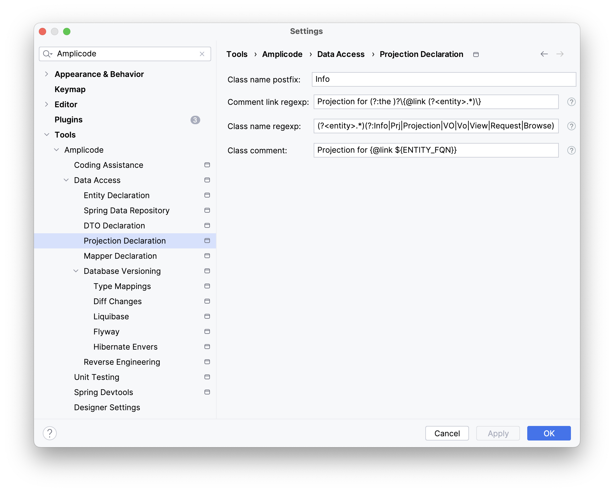

## Введение

**DTO (Data Transfer Object)** – это объект, который передает данные между процессами. DTO для доменного объекта обычно
содержат подмножество атрибутов доменного объекта. Например, если вам нужно предоставить только несколько полей через
REST API, вы можете сопоставить доменный объект с DTO, содержащими только эти атрибуты, и сериализовать только их. В
основном, DTO позволяют отделить слой представления/бизнес-логики от слоя доступа к данным.

[//]: # (//todo видео которое в JPA Buddy было про DTO)

## Создание DTO из доменного объекта

Amplicode предлагает создание DTO из доменных объектов с помощью визуального дизайнера.

Для того чтобы открыть диалог создания DTO, воспользуйтесь одним из следующих вариантов:

1. [Amplicode Explorer](todoaddlink) -> Кнопка "+" -> JPA -> DTO;
2. Project -> Правая кнопка мыши / (Cmd+N/Alt+Insert) -> New -> DTO;
3. Класс доменного объекта -> Editor Toolbar ->  DTOs and Spring Data Projections -> Create DTO;
4. Класс доменного объекта –> Контекстное меню (Alt/⌥ + Enter) -> Create DTO;
5. Класс доменного объекта -> [Amplicode Designer](todoaddlink) -> Actions -> Create DTO;
6. Неразрешённая ссылка, которая соответствует правилам именования указанным в настройках [DTO](#dto) -> Контекстное
   меню (Alt/⌥ + Enter) -> Create DTO;
7. Экземпляр доменного объекта -> [mapTo... постфикс](#умное-автодополнение-кода).

[//]: # (//что думаете по поводу карусели с картинками для таких кейсов?)

[//]: # (//картинка)

### Базовые параметры

Диалог создания DTO можно условно разделить на несколько частей. В верхней части можно настроить базовые параметры:

1. Source root;
2. Имя пакета;
3. Доменный объект;
4. Имя DTO;
5. Помимо этого, существует возможность [создать MapStruct интерфейс](todoaddlink) для преобразования доменного объекта
   в DTO и обратно. В случае, если библиотека еще не подключена к проекту, Amplicode предложит добавить её в один клик.

[//]: # (//картинка)

### Параметры генерации

Amplicode предоставляет широкий набор опций, влияющих на генерацию DTO:

1. Java record – Генерирует DTO как Java Record, обеспечивая краткое и неизменное представление DTO с автоматической
   реализацией методов `equals()`, `hashCode()` и `toString()`. Опция доступна только для проектов с версией SDK >= 16;
2. All args constructor – Генерирует конструктор, который принимает аргументы для всех полей DTO;
3. `equals()` и `hashCode()` – Генерирует методы `equals()` и `hashCode()` для DTO на основе его полей;
4. `toString()` – Генерирует метод `toString()` для DTO, предоставляя строковое представление его полей;
5. Mutable – По умолчанию сгенерированные DTO являются неизменными с final-полями и без сеттеров. Если вам нужны
   изменяемые DTO с изменяемыми полями и сеттерами, вы можете выбрать эту опцию.
6. Fluent setters – Эта опция доступна при выборе опции Mutable. Она позволяет сгенерированным сеттерам
   возвращать `this` вместо `void`, что позволяет выполнять цепочку вызовов методов для нескольких сеттеров.
7. Ignore unknown properties for json – Применяет аннотацию `@JsonIgnoreProperties(ignoreUnknown = true)` к DTO,
   позволяя ему игнорировать любые неизвестные свойства во время десериализации JSON. Данная опция доступна только при
   наличии зависимости [Jackson Annotations](todoaddlink) в проекте.

[//]: # (//картинка)

### Master-detail панель выбора атрибутов

Нижняя часть визуального дизайнера представляет собой master-detail панель выбора аттрибутов, которые будут включены в
DTO. При переключении между аргументами, интерфейс справа от списка аттрибутов изменяется, предоставляя необходимые
параметры. Например, в случае наличия библиотеки валидации,
отобразиться [список доступных валидаций](#поддержка-hibernate-validations). А в случае выбора ассоциативного аттрибута,
появиться возможность создания вложенных DTO.

[//]: # (//картинка)

#### Создание DTO для ассоциаций

Доменные объекты могут ссылаться на другие доменные объекты через ассоциации, и Amplicode позволяет генерировать для них
DTO из того же окна. Просто выберите поле доменной сущности в дереве и затем выберите тип DTO.

[//]: # (//картинка)

Всего для выбора доступны следующие типы DTO:

1. New Class - будет создан новый класс в отдельном файле;
2. New Nested Class - будет создан новый общедоступный статический вложенный класс;
3. Existing Class - вы можете выбрать существующий класс DTO, который уже существует в проекте;
4. Flat - все поля вложенного класса будут преобразованы в поля единственного сгенерированного DTO. Имена
   сгенерированных полей будут формироваться путем объединения имени внутреннего класса с именами его полей.

## Создание Projection из доменного объекта

Amplicode предлагает создание Spring Data Projection из доменных объектов с помощью визуального дизайнера.

Для того чтобы открыть диалог создания Spring Data Projection, воспользуйтесь одним из следующих вариантов:

1. [Amplicode Explorer](todoaddlink) / [Amplicode Designer](todoaddlink) -> Кнопка "+" -> JPA -> Spring Data Projection;
2. Project -> Правая кнопка мыши / (Cmd+N/Alt+Insert) -> New -> Other -> Spring Data Projection;
3. Класс доменного объекта -> Editor Toolbar ->  DTOs and Spring Data Projections -> Create Spring Data Projection;
4. Неразрешённая ссылка, которая соответствует правилам именования указанным в
   настройках [Spring Data Projection](#spring-data-projection) -> Контекстное меню (Alt/⌥ + Enter) -> Create
   Projection.

[//]: # (//картинка)

### Базовые параметры

Диалог создания Spring Data Projection можно условно разделить на несколько частей. В верхней части можно настроить
базовые параметры:

1. Source root;
2. Доменный объект;
3. Имя Spring Data Projection.

### Master-detail панель выбора атрибутов

Нижняя часть визуального дизайнера представляет собой master-detail панель выбора аттрибутов, которые будут включены в
Spring Data Projection. При переключении между аргументами, интерфейс снизу от списка аттрибутов изменяется,
предоставляя необходимые параметры. Например, в случае выбора ассоциативного аттрибута, появиться возможность создания
вложенных Spring Data Projection.

[//]: # (//картинка)

#### Создание Spring Data Projection для ассоциаций

Доменные объекты могут ссылаться на другие доменные объекты через ассоциации, и Amplicode позволяет генерировать для них
Spring Data Projection из того же окна. Просто выберите поле доменной сущности в дереве и затем выберите тип Spring Data
Projection.

[//]: # (//картинка)

Всего для выбора доступны следующие типы DTO:

1. New Class - будет создан новый класс в отдельном файле;
2. New Nested Class - будет создан новый общедоступный статический вложенный класс;
3. Existing Class - вы можете выбрать существующий класс DTO, который уже существует в проекте.

## Создание JPA сущностей из DTO

Amplicode предоставляет функцию "Create Entity from POJO", которая помогает создать JPA сущность из любого Java/Kotlin
класса. Эта возможность может быть полезной, если вы разрабатываете свое приложение, следуя подходу API-first: сначала
определяете DTO для API, а затем реализуйте модель данных.

[//]: # (//видео)

### Базовые параметры

Диалог создания JPA сущностей из DTO можно условно разделить на несколько частей. В верхней части можно настроить
базовые параметры:

1. Source root;
2. Имя пакета;
3. POJO класс;
4. Имя, которое будет установлено JPA сущности;
5. Родительская JPA сущность;
6. Помимо этого, существует возможность выбрать существующий или [создать новый MapStruct интерфейс](todoaddlink) для
   преобразования JPA сущности в DTO и обратно. Данная функциональность доступна только при
   наличии [MapStruct](#поддержка-mapstruct) зависимости.
7. Наконец, Amplicode предлагает создать новый атрибут который будут выступать в роли уникального идентификатора для JPA
   сущности. Альтернативно, можно выбрать один или несколько аттрибутов для id из уже существующих.

[//]: # (//картинка)

### Master-detail панель выбора атрибутов

Нижняя часть визуального дизайнера представляет собой master-detail панель выбора аттрибутов, которые будут включены в
JPA сущность. При переключении между аргументами, интерфейс справа от списка аттрибутов изменяется, предоставляя
необходимые параметры. Например, в случае наличия библиотеки валидации,
отобразиться [список доступных валидаций](#поддержка-hibernate-validations). А в случае выбора ассоциативного аттрибута,
появиться возможность настройки ассоциативных связей.

[//]: # (//картинка)

#### Настройка ассоциативных аттрибутов

Amplicode предоставляет широкие возможности настройки ассоциативных аттрибутов. Есть возможность выбрать тип аттрибута:

1. Transient – в сущности будет сгенерировано поле с тем же типом, что и в POJO классе, аннотированное
   аннотацией `@Transient`;
2. Create new Entity Class – в визуальном дизайнере появятся параметры необходимые
   для [новой JPA сущности](создание JPA сущности);
3. Select Existing Entity Class – в визуальном дизайнере появится возможность выбора существующей сущности из
   выпадающего списка.

Помимо этого, при выборе "Create new Entity Class" и "Select Existing Entity Class", необходимо будет
настроить [параметры ассоциативной связи](создание ассоциации), которая будет сгенерирована в новой JPA сущности.

[//]: # (//картинка)

## Навигация между DTO/Spring Data Projection и доменным объектом

Amplicode предоставляет удобную навигацию между доменными объектами и их DTO/Spring Data Projection.

<div class="note">
Правила связывания доменных объектов с их DTO/Spring Data Projection определяются в [настройках](настройки).
</div>

Amplicode позволяет открывать связанные DTO/Spring Data Projection из:

1. Editor Toolbar -> DTOs and Projections
2. Amplicode Explorer -> Persistence -> Доменный объект -> DTOs and Projections

Также, есть возможность перехода из доменного объекта в связанные DTO/Spring Data Projection и обратно,
используя [gutter icons](https://www.jetbrains.com/help/idea/settings-gutter-icons.html). Навигация через gutter icon
доступна как к классам в целом, так и к конкретным полям.

[//]: # (//картинка)

## Синхронизация DTO/Spring Data Projection и доменного объекта

Со временем доменный объект может изменяться, а DTO и Spring Data Projection зачастую могут изменяться вместе с ним.
Amplicode позволяет синхронизировать доменный объект с его DTO/Spring Data Projection.

<div class="note">
Правила связывания доменных объектов с их DTO/Spring Data Projection определяются в [настройках](настройки).
</div>

### Изменение полей

Amplicode расширяет возможности
стандартного [окна редактирования IntelliJ IDEA](https://www.jetbrains.com/help/idea/rename-refactorings.html), добавляя
значения полей из связанных DTO/Spring Data Projection.

[//]: # (//картинка)

### Добавление полей

#### Из доменного объекта в DTO/Spring Data Projection

Amplicode позволяет добавить аттрибуты из доменного объекта в одну или несколько связанных с ним DTO/Spring Data
Projection. Диалог добавления аттрибутов доступен из доменного объекта в DTO/Spring Data Projection доступен:

1. В контекстном меню для каждого из аттрибутов;
2. Editor Toolbar -> DTOs and Projections -> Add attributes to DTO;

[//]: # (//картинка)

Для добавления аттрибутов в открытую на данный момент DTO/Spring Data Projection, вызовите "Generate menu" и выберите
действие "Add attributes from entity".

[//]: # (//картинка)

Кроме того, Amplicode позволяет сгенерировать недостающие поля используя автодополнение. Просто начните печатать
название поле, которое есть в доменном объекте и выберите подходящий вариант из выпадающего списка.

[//]: # (//картинка)

#### В доменный объект из DTO/Spring Data Projection

Также, есть возможность добавить аттрибуты в доменный объект из связанных DTO/Spring Data Projection. Диалог добавления
аттрибутов доступен из DTO/Spring Data Projection в доменный объект доступен:

1. Generate menu ->  Entity attribute(s) from DTO;
2. Amplicode Designer -> Amplicode Palette -> Attributes -> From DTO;
3. Editor Toolbar -> Attributes -> From DTO.

[//]: # (//картинка)

## Поддержка MapStruct

<div class="note">
Описанная ниже функциональность доступна только при наличии подключенной к проекту библиотеки MapStruct.
</div>

[//]: # (//видео)

Amplicode позволяет сгенерировать MapStruct интерфейс через:

1. Amplicode Explorer -> Persistence -> Entity -> Правая кнопка мыши -> MapStruct Interface;
2. Project -> Правая кнопка мыши / (Cmd+N/Alt+Insert) -> New -> Other -> MapStruct Interface;
3. Диалог создания DTO -> MapStruct interface;
4. Диалог создания доменных объектов из DTO -> MapStruct interface;
5. Диалог делегирования методов -> Method Parameters / Return Options.

[//]: # (//картинки)

В диалоге создания MapStruct интерфейса можно настроить следующие параметры:

1. Доменный объект;
2. DTO класс;
3. Имя для интерфейса который будет сгенерирован;
4. Имя пакета.

[//]: # (//картинка)

По умолчанию, в MapStruct интерфейсе будут сгенерированы сигнатуры методов для преобразования DTO в доменный объект и
обратно, а также для частичного обновления. Например:

[//]: # (//пример)

### Генерация методов

Amplicode предоставляет возможностей создания отдельных методов для существующего MapStruct интерфейса. Диалог создания
MapStruct методов можно вызвать открыв "Generate Menu" (Cmd+N/Alt+Insert) и выбрав пункт "Mapper Methods...".

[//]: # (//картинка)

### Использование дженерик MapStruct интерфейса

MapStruct позволяет объявлять дженерик интерфейсы. Например:

```java
public interface EntityMapper<D, E> {
    E toEntity(D dto);

    D toDto(E entity);

    List<E> toEntity(List<D> dtoList);

    List<D> toDto(List<E> entityList);
}
```

Такой MapStruct интерфейса удобно использовать в качестве родительского для всех остальных интерфейсов, чтобы сохранить
их лаконичность. В случае обнаружения подобного дженерик интерфейса в проекте, Amplicode расширит окно создания
MapStruct интерфейса новой опцией – "Parent interface".

[//]: # (//картинка)

В результате, Amplicode сгенерирует MapStruct интерфейс с ключевым словом `extends` и указанием выбранных типов для
преобразования. Например:

```java

@Mapper(componentModel = "spring")
public interface UserMapper extends EntityMapper<UserDTO, User> {
}
```

Если же для преобразования будут требоваться дополнительные методы, Amplicode не забудет их сгенерировать. Например,
метод для связывания дочерних объектов:

```java

@Mapper(unmappedTargetPolicy = ReportingPolicy.IGNORE, componentModel = "spring")
public interface ProjectMapper extends EntityMapper<ProjectDTO, Project> {
    @AfterMapping
    default void linkTasks(@MappingTarget Project project) {
        project.getTasks().forEach(task -> task.setProject(project));
    }
}
```

## Поддержка ModelMapper

<div class="note">
Описанная ниже функциональность доступна только при наличии подключенной к проекту библиотеки ModelMapper.
</div>

ModelMapper – одна из самых популярных библиотек для преобразования доменных объектов в DTO и обратно. Amplicode
предоставляет множество функций, которые значительно упрощают процесс подобного преобразования, включая:

1. Генерацию кода для преобразования доменного объекта или списка доменных объектов в DTO и наоборот;
2. Создание сигнатур методов для написания логики преобразования вручную.

[//]: # (//Видео)

## Поддержка Lombok

<div class="note">
Описанная ниже функциональность доступна только при наличии подключенной к проекту библиотеки Lombok и включенной в [настройках](#настройки) опции "Use Lombok."

Amplicode предоставляет поддержку Lombok в тех случаях, когда это возможно. Например, если вы выбираете опции "All args
constructor," "equals() and hashCode()," и "toString()" в диалоге создания DTO, Amplicode аннотирует сгенерированное DTO
аннотацией `@Value`. Используя аннотацию `@Value`, будет излишним явно отмечать поля модификаторами `private` и `final`.
По этой причине, Amplicode не будет их генерировать в данном случае.

[//]: # (//картинка)

Или же, если вам нужен изменяемый DTO объект, с теми же параметрами, что и в приведенном выше примере, Amplicode добавит
аннотации `@Data`, `@AllArgsConstructor` и `@NoArgsConstructor` вместо `@Value`.

[//]: # (//картинка)

## Поддержка Hibernate Validator

<div class="note">
Описанная ниже функциональность доступна только при наличии подключенной к проекту библиотеки Hibernate Validator.
</div>

Hibernate Validator – библиотека для валидации данных. Hibernate Validator позволяет определять правила валидации с
использованием аннотаций. Amplicode, в свою очередь, позволяет применять правила валидации:

1. В уже существующих классах используя [Amplicode Designer](ссылка);
2. На этапе [создания DTO из доменного объекта](#создание-dto-из-доменного-объекта);
3. При [синхронизации доменного объекта со связанным DTO](#синхронизация-dtospring-data-projection-и-доменного-объекта).

[//]: # (//картинка)

## Поддержка Blaze Persistence

<div class="note">
Описанная ниже функциональность доступна только при наличии подключенной к проекту библиотеки Blaze Persistence.
</div>

Blaze-Persistence – это мощная библиотека для работы с данными. Она предлагает передовые методы взаимодействия с базами
данных, упрощая разработку доступа к данным и увеличивая производительность приложения. Одной из ключевых концепций
данной библиотеки является Entity View. Amplicode предлагает создание Entity View из доменных объектов с помощью
визуального дизайнера.

[//]: # (//видео)

### Базовые параметры

Диалог создания Entity View можно условно разделить на несколько частей. В верхней части можно настроить базовые
параметры:

1. Source root;
2. Имя пакета;
3. Родительская Entity View;
4. Доменный объект;
5. Имя Entity View.

Также есть возможность указать необходимо ли пометить Entity View аннотациями `@CreatableEntityView`
и `@UpdatableEntityView` используя чекбоксы "Creatable" и "Updatable" соответственно.

[//]: # (//картинка)

### Master-detail панель выбора атрибутов

Нижняя часть визуального дизайнера представляет собой master-detail панель выбора аттрибутов, которые будут включены в
Entity View. При переключении между аргументами, интерфейс справа от списка аттрибутов изменяется, предоставляя
необходимые параметры. Например, в случае выбора ассоциативного аттрибута, появиться возможность создания вложенных
Entity View.

[//]: # (//картинка)

#### Создание Entity View для ассоциаций

Доменные объекты могут ссылаться на другие доменные объекты через ассоциации, и Amplicode позволяет генерировать для них
Entity View из того же окна. Просто выберите поле доменной сущности в дереве и затем выберите тип Entity View.

[//]: # (//картинка)

Всего для выбора доступны следующие типы Entity View:

1. New Class - будет создан новый класс в отдельном файле;
2. New Nested Class - будет создан новый общедоступный статический вложенный класс;
3. Existing Class - вы можете выбрать существующую Entity View, которая уже существует в проекте;
4. Flat - все поля вложенного класса будут преобразованы в поля единственного сгенерированного Entity View. Имена
   сгенерированных полей будут формироваться путем объединения имени внутреннего класса с именами его полей.

## Настройки

Каждый проект по-своему уникален. Amplicode понимает это и предоставляет широкий спектр настроек.

### DTO

//картинка

В Preferences -> Tools -> Amplicode -> Data Access -> DTO Declaration вы можете настроить:

1. Сериализуемый тип;
2. Постфикс имени класса, который будет использоваться при генерации DTO;
3. Использовать ли аннотации из библиотеки Lombok при генерации DTO;
4. Регулярное выражение для комментариев, который будут использованы для связывания доменного объекта с его DTO. Для
   указания паттерна доменного объекта (Fully Qualified Name, FQN) в комментарии, используйте шаблон `(?<entity>.)`.
   Например, если в данном поле указано значение `DTO for (?:the )?\{@link (?<entity>.*)\}`, будет распознан следующий
   комментарий: `// DTO for {@link io.jpabuddy.demo.entities.Project} entity`. Описанная логика не работает, если поле
   пустое.
5. Регулярное выражение для имени класса. Эта опция полезна, если вы следуете конвенции именования для DTO. Данная
   настройка позволяет Amplicode ассоциировать DTO с соответствующим доменным объектом только по имени DTO. Вы можете
   указать паттерн для простого имени класса доменного объекта, используя шаблон `(?.)`. Например, паттерн `(?.)Dto`
   означает, что класс `MyEntityDto` будет считаться DTO для `MyEntity`. Описанная логика не работает, если поле пустое.
6. Комментарий к классу. Задает комментарий, который будет генерироваться над DTO при его создании.

### Spring Data Projection



В Preferences -> Tools -> Amplicode -> Data Access -> Projection Declaration вы можете настроить:

1. Постфикс имени класса, который будет использоваться при генерации Spring Projection;
2. Регулярное выражение для комментариев, который будут использованы для связывания доменного объекта с его Spring
   Projection. Для указания паттерна доменного объекта (Fully Qualified Name, FQN) в комментарии, используйте
   шаблон `(?<entity>.)`. Например, если в данном поле указано
   значение `Projection for (?:the )?\{@link (?<entity>.*)\}`, будет распознан следующий
   комментарий: `// Projection for {@link io.jpabuddy.demo.entities.Project} entity`. Описанная логика не работает, если
   поле пустое.
3. Регулярное выражение для имени класса. Эта опция полезна, если вы следуете конвенции именования для Projection.
   Данная настройка позволяет Amplicode ассоциировать Projection с соответствующим доменным объектом только по имени
   Projection. Вы можете указать паттерн для простого имени класса доменного объекта, используя шаблон `(?.)`. Например,
   паттерн `(?.)Projection` означает, что класс `MyEntityProjection` будет считаться Projection для `MyEntity`.
   Описанная логика не работает, если поле пустое.
4. Комментарий к классу. Задает комментарий, который будет генерироваться над Projection при её создании.

### MapStruct

[//]: # (//картинка)

Preferences -> Tools -> Amplicode -> Data Access -> Mapper Declaration вы можете настроить:

1. Правила именования методов преобразования доменных объектов в DTO и обратно;
2. Стратегию именования методов преобразования коллекций доменных объектов в DTO и обратно.
