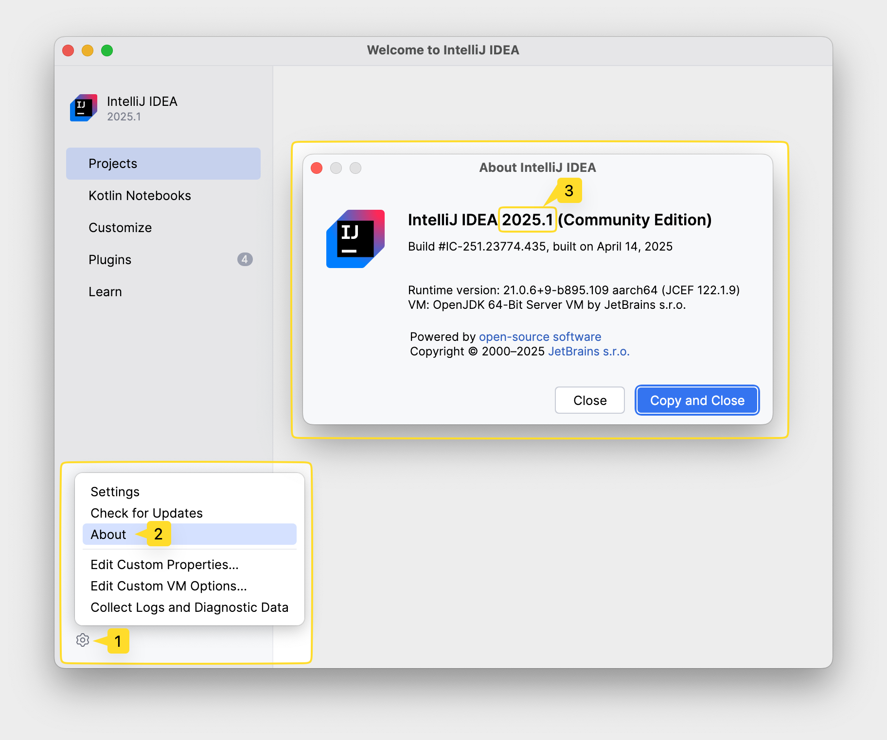

Amplicode для IntelliJ IDEA и GigaIDE включает в себя поддержку экосистемы Spring и связанных технологий, а также
предоставляет инструменты для работы с Docker и Docker Compose файлами.

**Мы крайне рекомендуем ознакомиться со следующим видео, чтобы получить наиболее полное представление о возможностях
Amplicode, доступных в IntelliJ IDEA и GigaIDE.**

<iframe width="720" height="405" src="https://rutube.ru/play/embed/6118c36e0626d3c990403acf80675862/" frameBorder="0" allow="clipboard-write; autoplay" webkitAllowFullScreen mozallowfullscreen allowFullScreen></iframe>

## Рекомендуемый способ установки

Для того чтобы установить Amplicode в IntelliJ IDEA или GigaIDE и автоматически получать обновления, необходимо:

1. Открыть настройки IntelliJ IDEA или GigaIDE и перейти в секцию **Plugins**
   
2. Нажать на иконку шестерёнки и выбрать пункт **Manage Plugin Repositories**
   
3. В открывшемся окне вставить
   ```java
   https://amplicode.ru/marketplace
   ```
   
   И нажать **ОК**
4. Ввести `Amplicode` в секции **Marketplace** и нажать **Install**
   
5. Перезапустить IDE
   

## Как узнать версию IntelliJ IDEA / GigaIDE?

1. Откройте IntelliJ IDEA или GigaIDE
2. В левом нижнем углу нажмите на иконку шестеренки и выберите пункт **About**
3. Самым крупным шрифтом будет обозначена версия вашей IDE



## Установка Amplicode вручную (через .zip файл)

Для того чтобы установить Amplicode вручную, необходимо:

1. Скачать архив с Amplicode для одной из поддерживаемых версий IntelliJ IDEA или GigaIDE (см. таблицы поддерживаемых
   версий ниже)
2. Открыть настройки IntelliJ IDEA или GigaIDE и перейти в секцию **Plugins**
   
3. Нажать на иконку шестерёнки и выбрать пункт **Install Plugin from Disk...**
   
4. Выбрать файл с архивом Amplicode (<u>**распаковывать архив не нужно**</u>) и нажать **OK**
5. Перезапустить IDE
   

## Поддерживаемые версии IntelliJ IDEA

Актуальная версия Amplicode поддерживает три последние мажорные версии IntelliJ IDEA, указанные в таблице. Если вы
использовали Amplicode на более старой версии IntelliJ IDEA, мы рекомендуем обновить её. Новая функциональность
Amplicode не будет доступна в устаревших версиях IDE.

| IntelliJ IDEA                          | Amplicode                                                                                                                 |
|----------------------------------------|---------------------------------------------------------------------------------------------------------------------------|
| 2025.3.X                               | <a href="https://amplicode.ru/Amplicode/amplicode-2025.2.3-253.zip" target="_blank" rel="noopener noreferrer">Скачать</a> |
| 2025.2.X                               | <a href="https://amplicode.ru/Amplicode/amplicode-2025.2.3-252.zip" target="_blank" rel="noopener noreferrer">Скачать</a> |
| 2025.1.X                               | <a href="https://amplicode.ru/Amplicode/amplicode-2025.2.3-251.zip" target="_blank" rel="noopener noreferrer">Скачать</a> |
| 2024.3.X                               | <a href="https://amplicode.ru/Amplicode/amplicode-2025.2.3-243.zip" target="_blank" rel="noopener noreferrer">Скачать</a> |
| 2024.2.X                               | <a href="https://amplicode.ru/Amplicode/amplicode-2025.2.3-242.zip" target="_blank" rel="noopener noreferrer">Скачать</a> |
| 2024.1.X, 2023.2.X, 2022.3.X, 2022.2.X | [Поддержка устаревших версий IntelliJ IDEA](#поддержка-устаревших-версий-intellij-idea)                                   |

## Поддержка устаревших версий IntelliJ IDEA

Акутальная версия Amplicode поддерживает
только [три последних мажорных версии IntelliJ IDEA](#поддерживаемые-версии-intellij-idea). Расширять этот диапазон
сложно — бэкпортинг фич на старые версии IDE требует много ресурсов, а большинство разработчиков обновляют среду
довольно быстро.

Важно: все новые фичи, вышедшие после Amplicode 2024.1, в устаревших IDE недоступны. Поэтому мы крайне рекомендуем вам
рассмотреть переезд с устаревших версий IDE на актуальную.

Если ваша команда пока не готова обновляться — свяжитесь с нами
через <a href="https://t.me/amplicode_chat" target="_blank" rel="noopener noreferrer">Telegram-чат</a>
или [форму на сайте](https://amplicode.io/contacts/), и мы поможем вам спланировать переезд.

Для перечисленных ниже версий IDE остаются доступными для использования старые версии Amplicode.

| Устаревшая версия IntelliJ IDEA | Устаревшая версия Amplicode (без новой функциональности)                                                                                      | Актуальная версия Amplicode                |
|---------------------------------|-----------------------------------------------------------------------------------------------------------------------------------------------|--------------------------------------------|
| 2024.1.X                        | <a href="https://amplicode.ru/Amplicode/amplicode-2024.3.6-241-EAP.zip" target="_blank" rel="noopener noreferrer">Скачать версию 2024.3.6</a> | Не поддерживается. Необходимо обновить IDE |
| 2023.2.X                        | <a href="https://amplicode.ru/Amplicode/amplicode-2024.1.6-232-EAP.zip" target="_blank" rel="noopener noreferrer">Скачать версию 2024.1.6</a> | Не поддерживается. Необходимо обновить IDE |
| 2022.3.X                        | <a href="https://amplicode.ru/Amplicode/amplicode-2024.1.6-223-EAP.zip" target="_blank" rel="noopener noreferrer">Скачать версию 2024.1.6</a> | Не поддерживается. Необходимо обновить IDE |
| 2022.2.X                        | <a href="https://amplicode.ru/Amplicode/amplicode-2024.1.6-222-EAP.zip" target="_blank" rel="noopener noreferrer">Скачать версию 2024.1.6</a> | Не поддерживается. Необходимо обновить IDE |

## Поддерживаемые версии GigaIDE

| GigaIDE  | Amplicode                                                                                                                 |
|----------|---------------------------------------------------------------------------------------------------------------------------|
| 2024.3.X | <a href="https://amplicode.ru/Amplicode/amplicode-2025.2.1-242.zip" target="_blank" rel="noopener noreferrer">Скачать</a> |
| 2024.2.X | <a href="https://amplicode.ru/Amplicode/amplicode-2025.2.1-242.zip" target="_blank" rel="noopener noreferrer">Скачать</a> |

## Лицензионная политика Amplicode

Подробнее про Amplicode PRO, триальную версию, специальные предложения и скидки читайте в разделе
[Лицензионная политика Amplicode](https://amplicode.ru/documentation/license-information/).

## Связаться с командой Amplicode

В случае если у вас возникли трудности на любом из этапов в процессе установки Amplicode или любые другие вопросы,
пожалуйста, напишите нам в:

* <a href="https://t.me/amplicode_chat" target="_blank" rel="noopener noreferrer">Telegram-чат</a>
* или на почту, через [форму на сайте](https://amplicode.io/contacts/)
