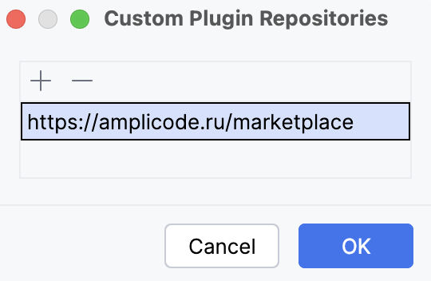

Amplicode для IntelliJ IDEA включает в себя поддержку экосистемы Spring и связанных технологий, а также предоставляет
инструменты для работы с Docker и Docker Compose файлами.

**Мы крайне рекомендуем ознакомиться со следующим видео, чтобы получить наиболее полное представление о возможностях
Amplicode, доступных в IntelliJ IDEA.**

<iframe width="720" height="405" src="https://rutube.ru/play/embed/6118c36e0626d3c990403acf80675862/" frameBorder="0" allow="clipboard-write; autoplay" webkitAllowFullScreen mozallowfullscreen allowFullScreen></iframe>

## Рекомендуемый способ установки

Для того чтобы установить Amplicode для IntelliJ IDEA и автоматически получать обновления, необходимо:

1. Открыть настройки IntelliJ IDEA и перейти в секцию **Plugins**
   
2. Нажать на иконку шестерёнки и выбрать пункт **Manage Plugin Repositories**
   
3. В открывшемся окне вставить
   ```java
   https://amplicode.ru/jetbrains-marketplace
   ```
   
   И нажать **ОК**
4. Ввести `Amplicode` в секции **Marketplace** и нажать **Install**
   
5. Перезапустить IntelliJ IDEA
   

## Установка Amplicode вручную (через .zip файл)

Для того чтобы установить Amplicode вручную, необходимо:

1. Скачать архив с Amplicode для одной из поддерживаемых версий IntelliJ IDEA:

   | IntelliJ IDEA | Amplicode                                                                                                                     |
      |---------------|-------------------------------------------------------------------------------------------------------------------------------|
   | 2024.2.X      | <a href="https://amplicode.ru/Amplicode/amplicode-2024.2.5-242-EAP.zip" target="_blank" rel="noopener noreferrer">Скачать</a> |
   | 2024.1.X      | <a href="https://amplicode.ru/Amplicode/amplicode-2024.2.5-241-EAP.zip" target="_blank" rel="noopener noreferrer">Скачать</a> |
   | 2023.3.Х      | <a href="https://amplicode.ru/Amplicode/amplicode-2024.2.5-233-EAP.zip" target="_blank" rel="noopener noreferrer">Скачать</a> |
   | 2023.2.Х      | <a href="https://amplicode.ru/Amplicode/amplicode-2024.1.4-232-EAP.zip" target="_blank" rel="noopener noreferrer">Скачать</a> |
   | 2022.3.Х      | <a href="https://amplicode.ru/Amplicode/amplicode-2024.1.4-223-EAP.zip" target="_blank" rel="noopener noreferrer">Скачать</a> |
   | 2022.2.X      | <a href="https://amplicode.ru/Amplicode/amplicode-2024.1.4-222-EAP.zip" target="_blank" rel="noopener noreferrer">Скачать</a> |

2. Открыть настройки IntelliJ IDEA и перейти в секцию **Plugins**
   
3. Нажать на иконку шестерёнки и выбрать пункт **Install Plugin from Disk...**
   
4. Выбрать файл с архивом Amplicode (**распаковывать архив не нужно**) и нажать **OK**
5. Перезапустить IntelliJ IDEA
   

## Поддерживаемые версии IntelliJ IDEA

В настоящее время **все возможности Amplicode доступны бесплатно**. Ниже вы можете найти таблицу с версиями Amplicode,
IntelliJ IDEA и датами, до которых лицензионная политика для соответствующих версий Amplicode не изменится. В будущем мы
можем изменить лицензионную политику, но обязуемся предупредить об этом **не менее чем за 3 месяца** до вступления
изменений в силу.

| Версия Amplicode | Версия IntelliJ IDEA                                         | Прекращение поддержки | Лицензионная политика |
|------------------|--------------------------------------------------------------|-----------------------|-----------------------|
| 2023.2.X-PRIVATE | 2022.3.X<br/>2023.2.X<br/>2023.3.X                           | 03.06.2024            | Бесплатно             |
| 2024.1.X-EAP     | 2022.2.X<br/>2022.3.X<br/>2023.2.X<br/>2023.3.X<br/>2024.1.X | 01.10.2024            | Бесплатно             |
| 2024.2.X-EAP     | 2023.3.X<br/>2024.1.X<br/>2024.2.X                           | 12.01.2025            | Бесплатно             |

_**Прекращение поддержки**: начиная с указанной даты, все возможности Amplicode станут недоступны до момента
обновления на более свежую версию. За месяц до указанной даты Amplicode начнёт напоминать о скором прекращении
поддержки._

Для того чтобы посмотреть версию IntelliJ IDEA:

1. Откройте окно Find Action (Cmd+Shift+A для MacOS, Ctrl+Shift+A для Win/Linux)
2. Найдите и выберите действие _About_


Если вы используете отличную от перечисленных выше версию IntelliJ IDEA и не можете обновиться на одну из поддерживаемых
Amplicode, пожалуйста, [свяжитесь с нами](#svyazatsya-s-komandoi-amplicode), и мы постараемся найти выход из сложившейся
ситуации!

## Связаться с командой Amplicode

В случае если у вас возникли трудности на любом из этапов в процессе установки Amplicode или любые другие вопросы,
пожалуйста, напишите нам в:

* <a href="https://t.me/amplicode_chat" target="_blank" rel="noopener noreferrer">Telegram-чат</a>
* <a href="https://vk.me/join/bO2OWNz17GZs_xpynqla/QJLPH/ZRERxvDY=" target="_blank" rel="noopener noreferrer">VK-чат</a>
* или на почту, через [форму на сайте](https://amplicode.io/contacts/)
