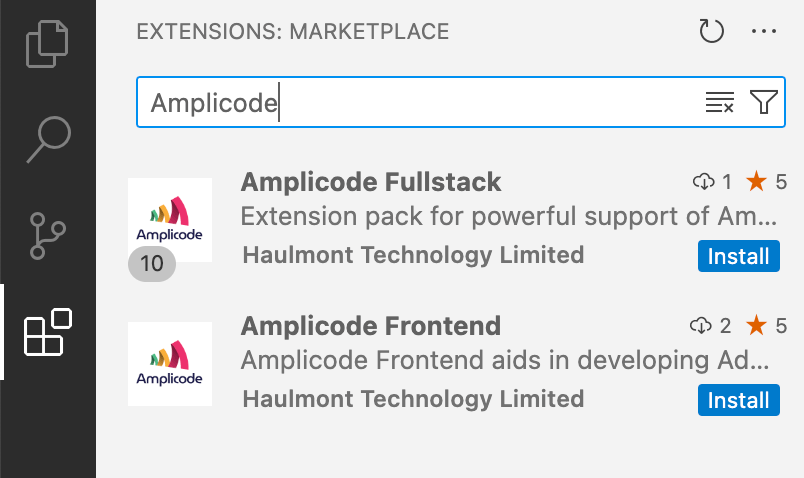
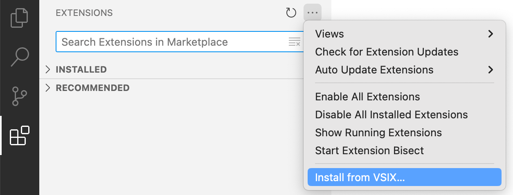
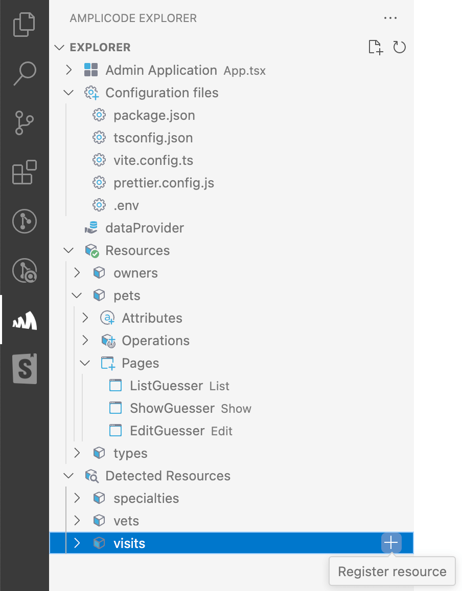
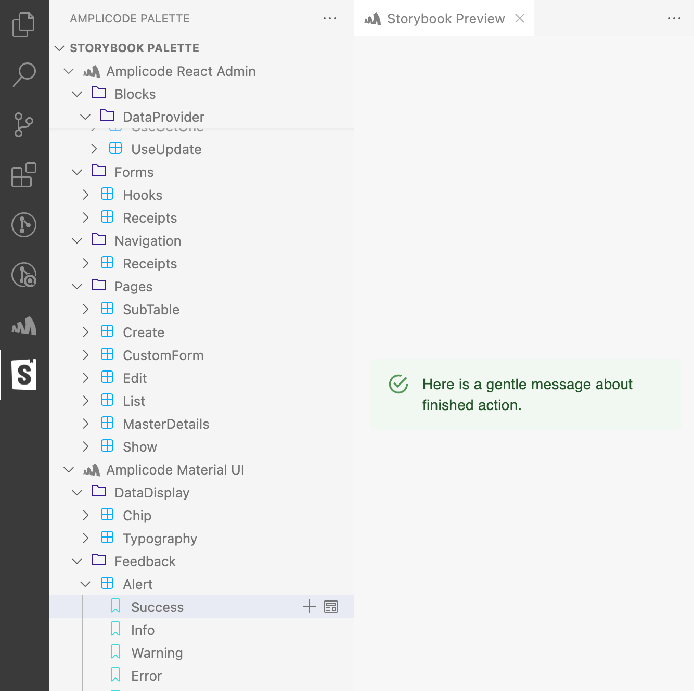
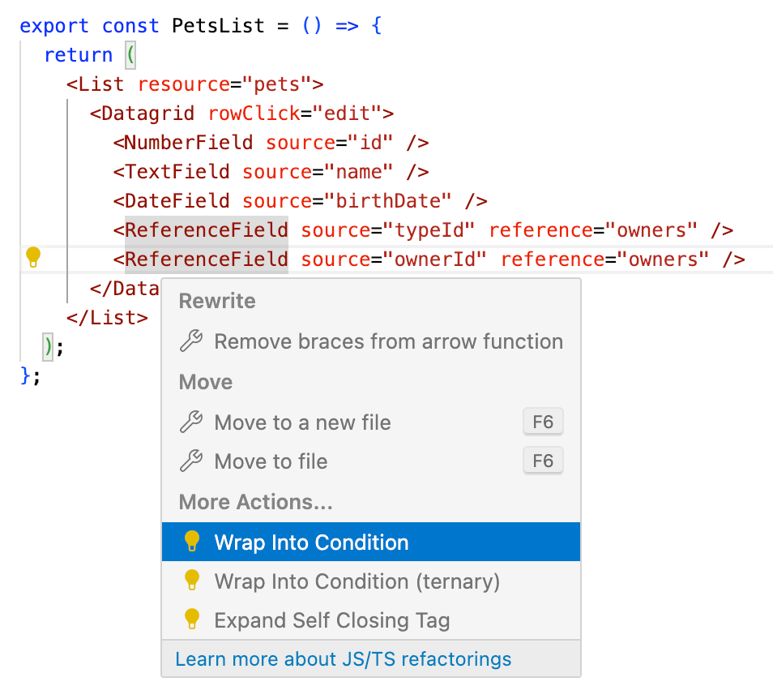

[//]: # (**Мы крайне рекомендуем ознакомиться со следующим видео, чтобы получить наиболее полное представление о возможностях)

[//]: # (Amplicode доступных в VS Code.**)

[//]: # ()
[//]: # ([//]: # &#40; todo add live about amplicode fullstack&#41;)

Amplicode предоставляет множество полезных расширений для VS Code, облегающих разработку frontend. Все перечисленные
ниже расширения могут быть установлены в VS Code также, как и любые другие расширения. Подробную инструкцию по установке расширений
можно
найти <a href="https://code.visualstudio.com/docs/editor/extension-marketplace#_install-an-extension" target="_blank" rel="noopener noreferrer">
в документации VS Code</a>.

### Установка расширения через VS Code Extensions Panel

Для установки расширения в VS Code воспользуйтесь панелью Extensions и введите в поиске **Amplicode**. После этого выберите расширение и нажмите кнопку **Install**.

### Ручная установка расширения через .VSIX

Помимо установки расширения напрямую через VS Code Extensions Marketplace, вы можете выполнить установку вручную, предварительно скачав `.vsix` файл расширения. `.VSIX` файл можно скачать с помощью браузера, воспользовавшись приведенными ниже ссылками. Откройте страницу расширения и нажмите **Download Extension**.

| Расширение           | URL                                                                                       |
|----------------------|-------------------------------------------------------------------------------------------|
| Amplicode Frontend   | https://marketplace.visualstudio.com/items?itemName=haulmont-tech-ltd.amplicode-frontend  |
| Amplicode Fullstack  | https://marketplace.visualstudio.com/items?itemName=haulmont-tech-ltd.amplicode-fullstack |

Обратите внимание, что для установки [Amplicode Fullstack](#amplicode-fullstack-extension-pack) в VSCodium вам придется установить все входящие в его состав расширения вручную.

Скаченный ранее файл расширения можно установить, воспользовавшись пунктом меню **Install from VSIX...** в панели Extensions.

### Amplicode Frontend

**<a href="https://marketplace.visualstudio.com/items?itemName=haulmont-tech-ltd.amplicode-frontend" target="blank" rel="noopener noreferrer">Amplicode Frontend</a>** – расширение VS Code для быстрой и комфортной разработки административного интерфейса с использованием React Admin, Storybook и TypeScript.

Backend разработчикам мы рекомендуем установить набор [Amplicode Fullstack](#amplicode-fullstack-extension-pack), который включает в себя дополнительные расширения для более удобной разработки frontend и подключает привычные IntelliJ-like сочетания горячих клавиш.

Расширение предоставляет:

- Интуитивно понятные визуальные компоненты для работы с <a href="https://marmelab.com/react-admin/" target="blank" rel="noopener noreferrer">React Admin</a> элементами, такими как data providers, resource names, fields, и т.д., благодаря панели Amplicode Explorer.
  
- Палитру для <a href="https://storybook.js.org/" target="blank" rel="noopener noreferrer">Storybook</a> с предварительным просмотром компонентов прямо в VS Code и их генерацию с учетом контекста.
  
- Интеллектуальный рефакторинг для TypeScript.
  
- Возможность лёгкого переключения между VS Code и IntelliJ IDEA (в случае
  использования [Amplicode для IntelliJ IDEA](#amplicode-для-intellij-idea)), которая облегчит жизнь не только
  frontend-, но и fullstack-разработчикам на <a href="https://spring.io/projects/spring-boot/" target="blank" rel="noopener noreferrer">Spring Boot</a> и <a href="https://react.dev/" target="blank" rel="noopener noreferrer">React</a>.

### Amplicode Fullstack Extension Pack

**<a href="https://marketplace.visualstudio.com/items?itemName=haulmont-tech-ltd.amplicode-fullstack" target="blank" rel="noopener noreferrer">Amplicode Fullstack Extension Pack</a>** - это набор расширений для удобной разработки приложений на Spring Boot и React Admin. Мы
рекомендуем использовать именно это расширение, если вы бóльшую часть времени разрабатываете в IntelliJ IDEA и хотите
получить максимум удовольствия от работы над frontend частью вашего приложения в VS Code.

**Amplicode Fullstack** включает в себя следующие расширения:

- <a href="https://marketplace.visualstudio.com/items?itemName=Haulmont.amplicode" target="blank" rel="noopener noreferrer">
  Amplicode Frontend</a>
- <a href="https://marketplace.visualstudio.com/items?itemName=k--kato.intellij-idea-keybindings" target="blank" rel="noopener noreferrer">
  IntelliJ IDEA Keybindings</a>
- <a href="https://marketplace.visualstudio.com/items?itemName=eamodio.gitlens" target="blank" rel="noopener noreferrer">
  GitLens — Git supercharged</a>
- <a href="https://marketplace.visualstudio.com/items?itemName=dbaeumer.vscode-eslint" target="blank" rel="noopener noreferrer">
  ESLint</a>
- <a href="https://marketplace.visualstudio.com/items?itemName=esbenp.prettier-vscode" target="blank" rel="noopener noreferrer">
  Prettier - Code formatter</a>
- <a href="https://marketplace.visualstudio.com/items?itemName=streetsidesoftware.code-spell-checker" target="blank" rel="noopener noreferrer">
  Code Spell Checker</a>
- <a href="https://marketplace.visualstudio.com/items?itemName=Zignd.html-css-class-completion" target="blank" rel="noopener noreferrer">
  IntelliSense for CSS class names in HTML</a>
- <a href="https://marketplace.visualstudio.com/items?itemName=sburg.vscode-javascript-booster" target="blank" rel="noopener noreferrer">
  JavaScript Booster</a>
- <a href="https://marketplace.visualstudio.com/items?itemName=burkeholland.simple-react-snippets" target="blank" rel="noopener noreferrer">
  Simple React Snippets</a>
- <a href="https://marketplace.visualstudio.com/items?itemName=planbcoding.vscode-react-refactor" target="blank" rel="noopener noreferrer">
  VSCode React Refactor</a>

После установки Amplicode Fullstack вы сможете найти в VS Code визуальные панели от Amplicode, входящие в состав
расширения [Amplicode Frontend](#amplicode-frontend).

## Связаться с командой Amplicode

В случае, если у вас возникли трудности на любом из этапов в процессе установки Amplicode или любые другие вопросы,
пожалуйста, напишите нам в:

* <a href="https://t.me/amplicode" target="_blank" rel="noopener noreferrer">Telegram</a>
* <a href="https://vk.com/amplicode" target="_blank" rel="noopener noreferrer">ВКонтакте</a>
* или на почту, через [форму на сайте](https://amplicode.io/contacts/)
