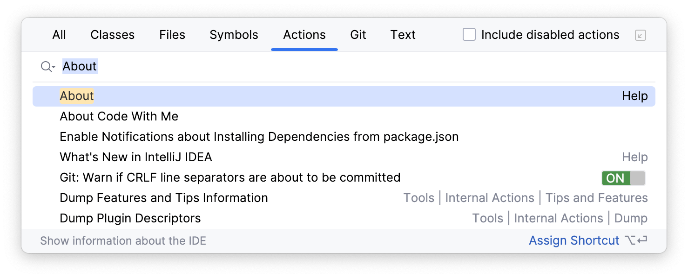
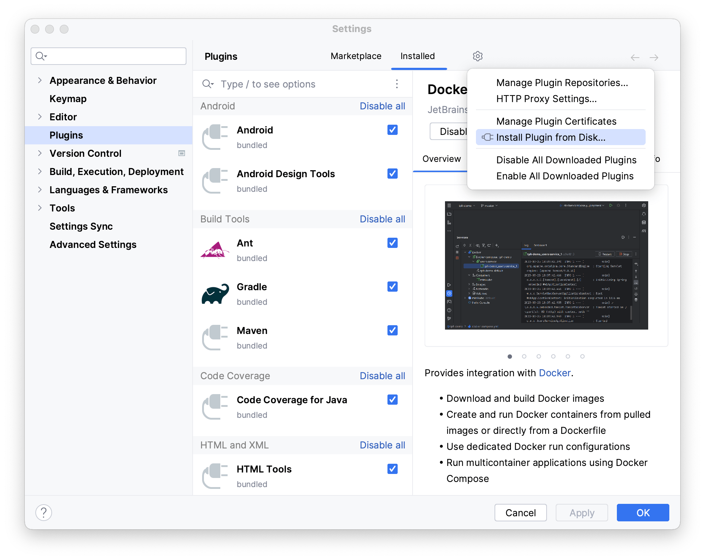

## Amplicode для IntelliJ IDEA

Amplicode для IntelliJ IDEA включает в себя поддержку экосистемы Spring и связанных технологий, а также предоставляет
инструменты для работы с Docker и Docker Compose файлами.

**Мы крайне рекомендуем ознакомиться со следующим видео, чтобы получить наиболее полное представление о возможностях
Amplicode доступных в IntelliJ IDEA.**

   <iframe 
      width="560" 
      height="315" 
      src="https://www.yout-ube.com/embed/g5kzePtZ9FQ" 
      title="YouTube video player" 
      allow="accelerometer; autoplay; clipboard-write; encrypted-media; gyroscope; picture-in-picture" 
      allowfullscreen
   ></iframe>

### Поддерживаемые версии IntelliJ IDEA

В настоящее время **все возможности Amplicode доступны бесплатно**. Ниже вы можете найти таблицу с версиями Amplicode,
IntelliJ IDEA и датами, до которых лицензионная политика для соответствующих версий Amplicode не изменится. В будущем мы
можем изменить лицензионную политику, но обязуемся предупредить об этом **не менее чем за полгода** до вступления
изменений в силу.

| Версия Amplicode | Версия IntelliJ IDEA                           | Прекращение поддержки | Лицензионная политика |
|------------------|------------------------------------------------|-----------------------|-----------------------|
| 2023.2.X-PRIVATE | 2022.3.X 2023.2.X 2023.3.X             | 03.06.2024            | Бесплатно             |
| 2024.1.X-EAP     | 2022.Х* 2023.2.X 2023.3.X 2024.1.X | 01.10.2024            | Бесплатно             |
| 2024.2.X-EAP     | 2023.2.X 2023.3.X 2024.1.X             | 12.01.2025            | Бесплатно             |

__*_ – Мы планируем выпустить поддержку IntelliJ IDEA 2022.X для указанных версий Amplicode к 01.05.2024._

_**Прекращение поддержки**: начиная с указанной даты, все возможности Amplicode станут недоступны до момента
обновления на более свежую версию. За месяц до указанной даты Amplicode начнёт напоминать о скором прекращении
поддержки._

Для того чтобы посмотреть версию IntelliJ IDEA:

1. Откройте окно Find Action (Cmd+Shift+A для MacOS, Ctrl+Shift+A для Win/Linux)
2. Найдите и выберите действие _About_

Если вы используете отличную от перечисленных выше версию IntelliJ IDEA и не можете обновиться на одну из поддерживаемых
Amplicode, пожалуйста, [свяжитесь с нами](#связаться-с-командой-amplicode) и мы постараемся найти выход из сложившейся
ситуации!

### Рекомендуемый способ установки

Для того чтобы установить Amplicode для IntelliJ IDEA и автоматически получать обновления, необходимо:

1. Открыть настройки IntelliJ IDEA и перейти в секцию **Plugins**
   
2. Нажать на иконку шестерёнки и выбрать пункт **Manage Plugin Repositories**
   
3. В открывшемся окне вставить `https://storage.yandexcloud.net/amplicode-marketplace/friday/updatePlugins-friday.xml`
   
   И нажать **ОК**
4. Ввести `Amplicode` в секции **Marketplace** и нажать **Install**
   
5. Перезапустить IntelliJ IDEA
   

### Установка Amplicode вручную (через .zip файл)

Для того чтобы установить Amplicode вручную, необходимо:

1. Скачать архив с Amplicode для одной из [поддерживаемых версий IntelliJ IDEA](#поддерживаемые-версии-intellij-idea)

   | IntelliJ IDEA | Amplicode                                                                                                                 |
   |---------------|---------------------------------------------------------------------------------------------------------------------------|
   | 2022.1.X      | Релиз запланирован на 01.05.2024                                                                                          |
   | 2022.2.X      | Релиз запланирован на 01.05.2024                                                                                          |
   | 2022.3.Х      | [2024.1.0-EAP.zip](https://storage.yandexcloud.net/amplicode-marketplace/friday/Amplicode/amplicode-2024.1.0-223-EAP.zip) |
   | 2023.2.Х      | [2024.1.0-EAP.zip](https://storage.yandexcloud.net/amplicode-marketplace/friday/Amplicode/amplicode-2024.1.0-232-EAP.zip) |
   | 2023.3.Х      | [2024.1.0-EAP.zip](https://storage.yandexcloud.net/amplicode-marketplace/friday/Amplicode/amplicode-2024.1.0-233-EAP.zip) |
   | 2024.1.X      | [2024.1.0-EAP.zip](https://storage.yandexcloud.net/amplicode-marketplace/friday/Amplicode/amplicode-2024.1.0-241-EAP.zip) |

2. Открыть настройки IntelliJ IDEA и перейти в секцию **Plugins**
   
3. Нажать на иконку шестерёнки и выбрать пункт **Install Plugin from Disk...**
   
4. Выбрать файл с архивом Amplicode и нажать **OK**
5. Перезапустить IntelliJ IDEA
   

### Активация Amplicode

После успешной установки, при первом открытие проекта на Spring Boot, Amplicode необходимо будет активировать, нажав на
кнопку **Enable Amplicode**.

Если к проекту не подключен ни один из
модулей <a href="https://spring.io/projects/spring-data" target="_blank" rel="noopener noreferrer">Spring Data</a>,
Amplicode предложит настроить проект:

Для успешной активации Amplicode **необходимо** в один из модулей проекта добавить один из доступных **Spring Data**
модулей. **Опционально**, можно улучшить любой из доступных модулей, подключив наиболее популярные стартеры/библиотеки
которые помогут сделать разработку более комфортной и эффективной с расширенной поддержкой от Amplicode.

После успешной активации, вы сможете увидеть панель **Amplicode Explorer** (1), а также контекстно-зависимые панели *
*Editor Toolbar** (2) и **Amplicode Designer** (3) для поддерживаемых файлов.

## Amplicode для VS Code

**Мы крайне рекомендуем ознакомиться со следующим видео, чтобы получить наиболее полное представление о возможностях
Amplicode доступных в VS Code.**

[//]: # ( todo add live about amplicode fullstack)

Amplicode предоставляет множество полезных расширений для VS Code, облегающих разработку frontend. Все перечисленные
ниже расширения могут быть установлены в VS Code также, как и любые другие расширения. Подробную инструкцию по установке расширений
можно
найти <a href="https://code.visualstudio.com/docs/editor/extension-marketplace#_install-an-extension" target="_blank" rel="noopener noreferrer">
в документации VS Code</a>.

### Установка расширения через VS Code Extensions Panel

Для установки расширения в VS Code воспользуйтесь панелью Extensions и введите в поиске **Amplicode**. После этого выберите расширение и нажмите кнопку **Install**.

### Ручная установка расширения через .VSIX

Помимо установки расширения напрямую через VS Code Extensions Marketplace, вы можете выполнить установку вручную, предварительно скачав `.vsix` файл расширения. `.VSIX` файл можно скачать с помощью браузера, воспользовавшись приведенными ниже ссылками. Откройте страницу расширения и нажмите **Download Extension**.

| Расширение           | URL                                                                                       |
|----------------------|-------------------------------------------------------------------------------------------|
| Amplicode Frontend   | https://marketplace.visualstudio.com/items?itemName=haulmont-tech-ltd.amplicode-frontend  |
| Amplicode Fullstack  | https://marketplace.visualstudio.com/items?itemName=haulmont-tech-ltd.amplicode-fullstack |

Обратите внимание, что для установки [Amplicode Fullstack](#amplicode-fullstack-extension-pack) в VSCodium вам придется установить все входящие в его состав расширения вручную.

Скаченный ранее файл расширения можно установить, воспользовавшись пунктом меню **Install from VSIX...** в панели Extensions.

### Amplicode Frontend

**<a href="https://marketplace.visualstudio.com/items?itemName=haulmont-tech-ltd.amplicode-frontend" target="blank" rel="noopener noreferrer">Amplicode Frontend</a>** – расширение VS Code для быстрой и комфортной разработки административного интерфейса с использованием React Admin, Storybook и TypeScript.

Backend разработчикам мы рекомендуем установить набор [Amplicode Fullstack](#amplicode-fullstack-extension-pack), который включает в себя дополнительные расширения для более удобной разработки frontend и подключает привычные IntelliJ-like сочетания горячих клавиш.

Расширение предоставляет:

- Интуитивно понятные визуальные компоненты для работы с <a href="https://marmelab.com/react-admin/" target="blank" rel="noopener noreferrer">React Admin</a> элементами, такими как data providers, resource names, fields, и т.д., благодаря панели Amplicode Explorer.
    
- Палитру для <a href="https://storybook.js.org/" target="blank" rel="noopener noreferrer">Storybook</a> с предварительным просмотром компонентов прямо в VS Code и их генерацию с учетом контекста.
    
- Интеллектуальный рефакторинг для TypeScript.
    
- Возможность лёгкого переключения между VS Code и IntelliJ IDEA (в случае
  использования [Amplicode для IntelliJ IDEA](#amplicode-для-intellij-idea)), которая облегчит жизнь не только
  frontend-, но и fullstack-разработчикам на <a href="https://spring.io/projects/spring-boot/" target="blank" rel="noopener noreferrer">Spring Boot</a> и <a href="https://react.dev/" target="blank" rel="noopener noreferrer">React</a>.

### Amplicode Fullstack Extension Pack

**<a href="https://marketplace.visualstudio.com/items?itemName=haulmont-tech-ltd.amplicode-fullstack" target="blank" rel="noopener noreferrer">Amplicode Fullstack Extension Pack</a>** - это набор расширений для удобной разработки приложений на Spring Boot и React Admin. Мы
рекомендуем использовать именно это расширение, если вы бóльшую часть времени разрабатываете в IntelliJ IDEA и хотите
получить максимум удовольствия от работы над frontend частью вашего приложения в VS Code.

**Amplicode Fullstack** включает в себя следующие расширения:

- <a href="https://marketplace.visualstudio.com/items?itemName=Haulmont.amplicode" target="blank" rel="noopener noreferrer">
  Amplicode Frontend</a>
- <a href="https://marketplace.visualstudio.com/items?itemName=k--kato.intellij-idea-keybindings" target="blank" rel="noopener noreferrer">
  IntelliJ IDEA Keybindings</a>
- <a href="https://marketplace.visualstudio.com/items?itemName=eamodio.gitlens" target="blank" rel="noopener noreferrer">
  GitLens — Git supercharged</a>
- <a href="https://marketplace.visualstudio.com/items?itemName=dbaeumer.vscode-eslint" target="blank" rel="noopener noreferrer">
  ESLint</a>
- <a href="https://marketplace.visualstudio.com/items?itemName=esbenp.prettier-vscode" target="blank" rel="noopener noreferrer">
  Prettier - Code formatter</a>
- <a href="https://marketplace.visualstudio.com/items?itemName=streetsidesoftware.code-spell-checker" target="blank" rel="noopener noreferrer">
  Code Spell Checker</a>
- <a href="https://marketplace.visualstudio.com/items?itemName=Zignd.html-css-class-completion" target="blank" rel="noopener noreferrer">
  IntelliSense for CSS class names in HTML</a>
- <a href="https://marketplace.visualstudio.com/items?itemName=sburg.vscode-javascript-booster" target="blank" rel="noopener noreferrer">
  JavaScript Booster</a>
- <a href="https://marketplace.visualstudio.com/items?itemName=burkeholland.simple-react-snippets" target="blank" rel="noopener noreferrer">
  Simple React Snippets</a>
- <a href="https://marketplace.visualstudio.com/items?itemName=planbcoding.vscode-react-refactor" target="blank" rel="noopener noreferrer">
  VSCode React Refactor</a>

После установки Amplicode Fullstack вы сможете найти в VS Code визуальные панели от Amplicode, входящие в состав
расширения [Amplicode Frontend](#amplicode-frontend).

## Связаться с командой Amplicode

В случае, если у вас возникли трудности на любом из этапов в процессе установки Amplicode или любые другие вопросы,
пожалуйста, напишите нам в:

* <a href="https://t.me/amplicode" target="_blank" rel="noopener noreferrer">Telegram</a>
* <a href="https://vk.com/amplicode" target="_blank" rel="noopener noreferrer">ВКонтакте</a>
* или на почту, через [форму на сайте](https://amplicode.io/contacts/)
