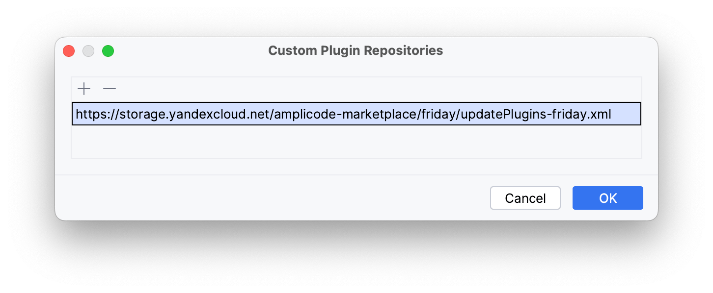
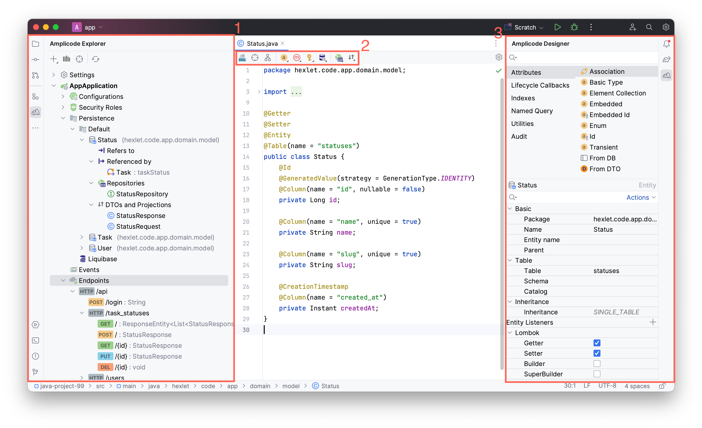

## Требования

Amplicode может быть установлен в IntelliJ IDEA одной из следующих версий: 

* IntelliJ IDEA 2022.3.X
* IntelliJ IDEA 2023.2.X
* IntelliJ IDEA 2023.3.X

## Рекомендуемый способ установки

Для того, чтобы установить Amplicode как любой другой плагин для IntelliJ IDEA и автоматически получать обновления, необходимо: 

1. Открыть настройки IntelliJ IDEA и перейти в секцию **Plugins**
   
2. Нажать на иконку шестерёнки и выбрать пункт **Manage Plugin Repositories**
   
3. В открывшемся окне вставить `https://storage.yandexcloud.net/amplicode-marketplace/friday/updatePlugins-friday.xml`
   
   И нажать **ОК**
4. Ввести `Amplicode` в секции **Marketplace** и нажать **Install**
   
5. Перезапустить IntelliJ IDEA
   

## Установка Amplicode вручную (через .zip файл)

Для того, чтобы установить Amplicode вручную необходимо:

1. Скачать архив с нужной версией Amplicode
2. Открыть настройки IntelliJ IDEA и перейти в секцию **Plugins**
   
3. Нажать на иконку шестерёнки и выбрать пункт **Install Plugin from Disk...**
   
4. Выбрать файл с архивом Amplicode и нажать **OK**
5. Перезапустить IntelliJ IDEA
   

## Как проверить что всё работает как надо 

После того, как Amplicode был установлен, в Spring Boot проекте вы сможете увидеть панель **Amplicode Explorer** (1), а также контекстно зависимые панели **Editor Toolbar** (2) и **Amplicode Designer** (3). 

## Что-то пошло не так 

В случае, если у вас возникли трудности на любом из этапов в процессе установки Amplicode, пожалуйста, напишите нам в <a href="https://t.me/amplicode" target="_blank" rel="noopener noreferrer">телеграм</a>!