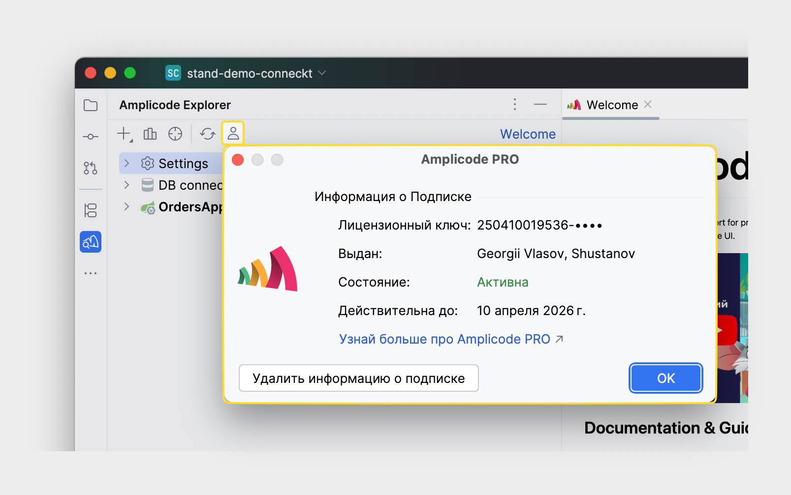
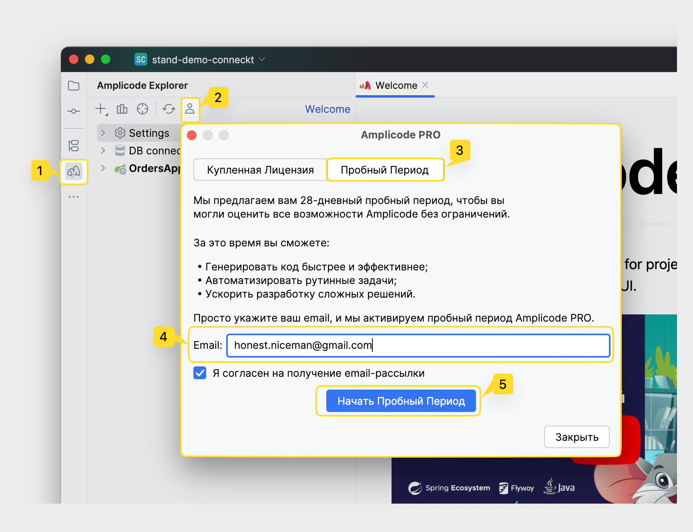
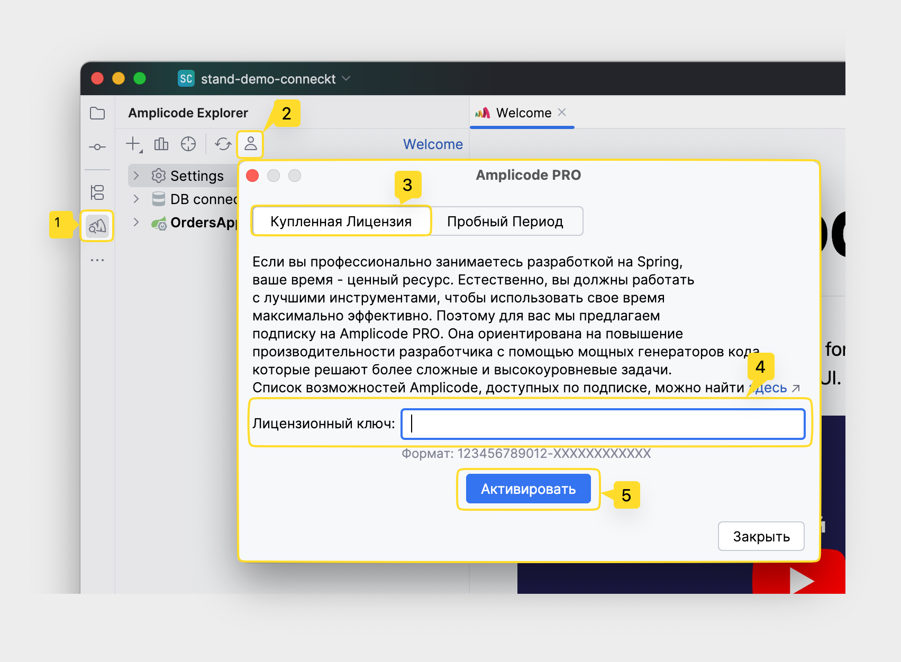

## Amplicode и Amplicode PRO

Amplicode доступен в двух версиях. Бесплатная версия предлагает удобную навигацию по бинам, инспекции, автодополнения,
а также панели Amplicode Explorer, Amplicode Designer и некоторые другие возможности, значительно повышая комфорт работы
со Spring.

Для профессиональных разработчиков мы рекомендуем Amplicode PRO, в котором доступны все возможности продукта.
Amplicode PRO поднимает вашу продуктивность на новый уровень, позволяя существенно экономить самый ценный ресурс – ваше
время.

Подробнее про Amplicode и Amplicode PRO читайте в
разделе <a href="https://amplicode.ru/prices" target="_blank" rel="noopener noreferrer">Цены</a>.

## Получить информацию о лицензии Amplicode PRO

1. Откройте проект на Spring
2. Откройте панель Amplicode Explorer
3. Выберите пункт верхнего меню "Subscription info"

## Триальная версия Amplicode PRO

28-дневная триальная версия Amplicode PRO будет автоматически активирована после открытия Spring проекта в IDE. После
окончания пробного периода вы сможете продолжать использовать <u>бесплатную функциональность</u> или
<a href="https://amplicode.ru/prices" target="_blank" rel="noopener noreferrer">приобрести лицензию</a> и продолжить
пользоваться всеми возможностями Amplicode PRO.

Если по каким-то причинам триальная версия Amplicode PRO не была активирована автоматически, вы можете сделать это
вручную. Для этого:

0. Откройте Spring-проект в вашей IDE
1. Откройте панель **Amplicode Explorer**
2. Выберите действие **Subscription Information** в верхней части панели
3. Выберите **Пробный Период**
4. Заполните поле **Email**
5. Нажмите **Начать Пробный Период**.

## Активировать лицензию Amplicode PRO

0. Откройте Spring-проект в вашей IDE
1. Откройте панель **Amplicode Explorer**
2. Выберите действие **Subscription Information** в верхней части панели
3. Выберите **Купленная Лицензия**
4. Вставьте лицензионный ключ Amplicode PRO
   из <a href="https://store.amplicode.ru/account" target="_blank" rel="noopener noreferrer">личного кабинета</a> в
   текстовое поле **Лицензионный ключ**
5. Нажмите **Активировать**.

## Лицензионная политика в отношении EAP-версий Amplicode

Ниже вы можете найти таблицу с версиями Amplicode и датами, до которых лицензионная политика для соответствующих версий
Amplicode не изменится.

| Версия Amplicode | Прекращение поддержки | Лицензионная политика |
|------------------|-----------------------|-----------------------|
| 2023.2.X-PRIVATE | 03.06.2024            | Бесплатно             |
| 2024.1.X-EAP     | 01.10.2024            | Бесплатно             |
| 2024.2.X-EAP     | 12.01.2025            | Бесплатно             |
| 2024.3.X-EAP     | 18.05.2025            | Бесплатно             |

_**Прекращение поддержки**: начиная с указанной даты, все возможности Amplicode станут недоступны до момента
обновления на более свежую версию. За месяц до указанной даты Amplicode начнёт напоминать о скором прекращении
поддержки._

## Специальные предложения и скидки

Для некоторых групп пользователей мы предлагаем особые условия:

* Amplicode является полностью бесплатным для студентов, и преподавателей профильных ИТ-вузов, а также обучающихся на
  курсах по Java и Spring. Для бывших студентов мы предлагаем скидки до 50%.
* Активные баг-репортеры могут получить бесплатные лицензии в знак признания их вклада в развитие продукта.
* Малые ИТ-компании могут рассчитывать на скидки до 50%.
* Если вы готовы рассказать об опыте использования Amplicode в вашей
  компании, <a href="https://amplicode.ru/contacts/" target="_blank" rel="noopener noreferrer">напишите нам,</a> и мы
  найдем способ выразить вам благодарность.

## Связаться с командой Amplicode

В случае если у вас возникли трудности на любом из этапов в процессе установки Amplicode или любые другие вопросы,
пожалуйста, напишите нам в:

* <a href="https://t.me/amplicode_chat" target="_blank" rel="noopener noreferrer">Telegram-чат</a>
* или на почту, через [форму на сайте](https://amplicode.io/contacts/)
