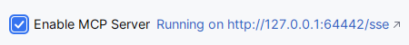
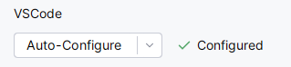
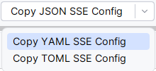

Spring Agent — это встроенный MCP Server в плагине Amplicode для OpenIDE / IntelliJ IDEA / GigaIDE. Он предоставляет AI-агентам доступ к инструментам анализа и генерации кода для Spring-проектов непосредственно из вашей IDE.

## Шаг 1. Включение MCP Server

Перед подключением любого AI-агента необходимо запустить MCP Server:

1. Откройте настройки IDE: **File → Settings** (или **IntelliJ IDEA → Settings** на macOS)
2. Перейдите в **Tools → Amplicode → MCP Server**
3. Убедитесь, что флажок **Enable MCP Server** установлен

После включения рядом с флажком отобразится адрес сервера: `Running on http://127.0.0.1:64442/sse`



## Автоматическая конфигурация клиента

Для ряда клиентов Amplicode поддерживает автоматическую настройку. Если ваш клиент присутствует в разделе **Clients Auto-Configuration**, выполните следующие действия:

1. В панели **Tools → Amplicode → MCP Server** найдите раздел **Clients Auto-Configuration**
2. Найдите нужный клиент в списке
3. Нажмите **Auto-Configure** напротив него
4. После успешной настройки рядом появится статус **✓ Configured**



> Если после нажатия **Auto-Configure** отображается сообщение _«restart the client if changes aren't applied»_, перезапустите AI-клиент.

Автоматическая конфигурация поддерживается для следующих клиентов:

- [VSCode](#vscode)
- [Claude Code](#claude-code)
- [Windsurf](#windsurf)
- [Codex](#codex)
- [Continue](#continue)
- [Qwen Code](#qwen-code)
- [OpenCode](#opencode)
- [Cline](#cline)
- [Copilot](#copilot)

Для остальных клиентов используйте [ручную конфигурацию](#ручная-конфигурация).

---

## Ручная конфигурация

Если ваш клиент не поддерживает автоматическую настройку, воспользуйтесь ручным способом:

1. В панели **Tools → Amplicode → MCP Server** найдите раздел **Manual Configuration**
2. Нажмите **Copy JSON SSE Config**, **Copy YAML SSE Config** или **Copy TOML SSE Config** — конфигурация будет скопирована в буфер обмена в выбранном формате



Скопированная конфигурация в формате JSON имеет вид:

```json
{
  "amplicode": {
    "type": "sse",
    "url": "http://127.0.0.1:64442/sse"
  }
}
```

Инструкции по добавлению этой конфигурации в каждый клиент описаны ниже.

---

## VSCode

**Поддерживает Auto-Configure: да**

### Автоматически

Используйте кнопку **Auto-Configure** в панели **Tools → Amplicode → MCP Server → VSCode**.

### Вручную

Откройте файл конфигурации MCP для VS Code (в выпадающем списке рядом с **Auto-Configure** → **Open Client Settings File**). Расположение файла:

- **macOS**: `~/Library/Application Support/Code/User/mcp.json`
- **Linux**: `~/.config/Code/User/mcp.json`
- **Windows**: `%APPDATA%\Code\User\mcp.json`

Добавьте конфигурацию:

```json
{
  "servers": {
    "amplicode": {
      "url": "http://127.0.0.1:64442/sse",
      "type": "sse"
    }
  }
}
```

После сохранения перезагрузите окно VS Code (**Developer: Reload Window**).

---

## Claude Code

**Поддерживает Auto-Configure: да**

### Автоматически

Используйте кнопку **Auto-Configure** в панели **Tools → Amplicode → MCP Server → Claude Code**.

### Вручную

Выполните команду в терминале:

```bash
claude mcp add --transport sse amplicode http://127.0.0.1:64442/sse
```

Или добавьте конфигурацию вручную через:

```bash
claude mcp add amplicode --transport sse http://127.0.0.1:64442/sse
```

Для проверки подключения выполните:

```bash
claude mcp list
```
---

## Windsurf

**Поддерживает Auto-Configure: да**

### Автоматически

Используйте кнопку **Auto-Configure** в панели **Tools → Amplicode → MCP Server → Windsurf**.

### Вручную

Откройте файл конфигурации MCP для Windsurf (в выпадающем списке рядом с **Auto-Configure** → **Open Client Settings File**). Расположение файла:

- **macOS**: `~/.codeium/windsurf/mcp_config.json`
- **Linux**: `~/.codeium/windsurf/mcp_config.json`
- **Windows**: `%USERPROFILE%\.codeium\windsurf\mcp_config.json`

Добавьте конфигурацию:

```json
{
  "mcpServers": {
    "amplicode": {
      "serverUrl": "http://127.0.0.1:64442/sse"
    }
  }
}
```

Сохраните файл и перезапустите Windsurf.

---

## Codex

**Поддерживает Auto-Configure: да**

### Автоматически

Используйте кнопку **Auto-Configure** в панели **Tools → Amplicode → MCP Server → Codex**.

### Вручную

Откройте файл конфигурации MCP для Codex (в выпадающем списке рядом с **Auto-Configure** → **Open Client Settings File**). Расположение файла:

- **macOS**: `~/.codex/config.toml`
- **Linux**: `~/.codex/config.toml`
- **Windows**: `%USERPROFILE%\.codex\config.toml`

Добавьте конфигурацию:

```toml
[mcp_servers.amplicode]
type = "sse"
url = "http://127.0.0.1:64442/sse"
```

Если файл конфигурации использует формат JSON (`~/.codex/config.json`), то добавьте следующее:

```json
{
  "mcpServers": {
    "amplicode": {
      "type": "sse",
      "url": "http://127.0.0.1:64442/sse"
    }
  }
}
```

Если файл конфигурации использует формат YAML (`~/.codex/config.yaml`), то добавьте следующее:

```yaml
mcpServers:
  amplicode:
    type: sse
    url: http://127.0.0.1:64442/sse
```

Сохраните файл и перезапустите Codex.

---

## Continue

**Поддерживает Auto-Configure: да**

### Автоматически

Используйте кнопку **Auto-Configure** в панели **Tools → Amplicode → MCP Server → Continue**.

### Вручную

Откройте файл конфигурации MCP для Continue (в выпадающем списке рядом с **Auto-Configure** → **Open Client Settings File**). Расположение файла:

- **macOS**: `~/.continue/config.yaml`
- **Linux**: `~/.continue/config.yaml`
- **Windows**: `%USERPROFILE%\.continue\config.yaml`

Также поддерживается конфигурация проекта: `.continue/config.yaml` в корне проекта.

Добавьте конфигурацию:

```yaml
mcpServers:
  - name: amplicode
    url: http://127.0.0.1:64442/sse
    type: sse
```

> Начиная с актуальных версий Continue формат `config.yaml` является основным. Если у вас используется устаревший `config.json`, рекомендуется мигрировать на YAML согласно [официальной документации Continue](https://docs.continue.dev/reference).

Сохраните файл и перезапустите Continue.

---

## Qwen Code

**Поддерживает Auto-Configure: да**

### Автоматически

Используйте кнопку **Auto-Configure** в панели **Tools → Amplicode → MCP Server → Qwen Code**.

### Вручную

Откройте файл конфигурации MCP для Qwen Code (в выпадающем списке рядом с **Auto-Configure** → **Open Client Settings File**). Расположение файла:

- **macOS**: `~/.qwen/settings.json`
- **Linux**: `~/.qwen/settings.json`
- **Windows**: `%USERPROFILE%\.qwen\settings.json`

Добавьте конфигурацию:

```json
{
  "mcpServers": {
    "amplicode": {
      "type": "sse",
      "url": "http://127.0.0.1:64442/sse"
    }
  }
}
```

Сохраните файл и перезапустите Qwen Code.

---

## OpenCode

**Поддерживает Auto-Configure: да**

### Автоматически

Используйте кнопку **Auto-Configure** в панели **Tools → Amplicode → MCP Server → OpenCode**.

### Вручную

Откройте файл конфигурации MCP для OpenCode (в выпадающем списке рядом с **Auto-Configure** → **Open Client Settings File**). Расположение файла:

- **macOS**: `~/.config/opencode/opencode.json`
- **Linux**: `~/.config/opencode/opencode.json`
- **Windows**: `%USERPROFILE%\.config\opencode\opencode.json`

Также поддерживается конфигурация проекта: `opencode.json` в корне проекта.

Добавьте конфигурацию:

```json
{
  "mcp": {
    "amplicode": {
      "url": "http://127.0.0.1:64442/sse",
      "type": "remote"
    }
  }
}
```

Сохраните файл и перезапустите OpenCode.

---

## Cline

**Поддерживает Auto-Configure: да**

### Автоматически

Используйте кнопку **Auto-Configure** в панели **Tools → Amplicode → MCP Server → Cline**.

### Вручную

Откройте файл конфигурации MCP для Cline (в выпадающем списке рядом с **Auto-Configure** → **Open Client Settings File**). Расположение файла:

- **macOS**: `~/.cline/data/settings/cline_mcp_settings.json`
- **macOS / Linux**: `~/.cline/data/settings/cline_mcp_settings.json`
- **Windows**: `%USERPROFILE%\.cline\data\settings\cline_mcp_settings.json`

Добавьте конфигурацию:

```json
{
  "mcpServers": {
    "amplicode": {
      "type": "streamableHttp",
      "url": "http://127.0.0.1:64442/stream"
    }
  }
}
```

Сохраните файл и перезапустите Cline.

---

## Copilot

**Поддерживает Auto-Configure: да**

### Автоматически

Используйте кнопку **Auto-Configure** в панели **Tools → Amplicode → MCP Server → Coplilot**.

### Вручную

Откройте файл конфигурации MCP для Copilot (в выпадающем списке рядом с **Auto-Configure** → **Open Client Settings File**). Расположение файла:

- **macOS**: `~/.config/github-copilot/intellij/mcp.json`
- **Linux**: `~/.config/github-copilot/intellij/mcp.json`
- **Windows**: `%USERPROFILE%\AppData\Local\github-copilot\intellij\mcp.json`

Добавьте конфигурацию:

```json
{
  "servers": {
    "amplicode": {
      "url": "http://127.0.0.1:64442/stream",
      "type": "streamableHttp"
    }
  }
}
```

Сохраните файл и перезапустите Copilot.

---

## Cursor

**Поддерживает Auto-Configure: нет**

Откройте файл конфигурации MCP для Cursor. Расположение:

- **Глобальная конфигурация**: `~/.cursor/mcp.json`
- **Конфигурация проекта**: `.cursor/mcp.json` в корне проекта

Добавьте конфигурацию:

```json
{
  "mcpServers": {
    "amplicode": {
      "type": "sse",
      "url": "http://127.0.0.1:64442/sse"
    }
  }
}
```

Если файл `mcp.json` уже существует, добавьте `"amplicode"` в секцию `mcpServers`.

После сохранения перезапустите Cursor или откройте **Cursor Settings → MCP** и нажмите **Refresh**.

---

## Kilo Code

**Поддерживает Auto-Configure: нет**

Kilo Code — расширение для VS Code. Откройте настройки расширения одним из способов:

**Через файл настроек VS Code** (`settings.json`):

```json
{
  "kilocode.mcpServers": {
    "amplicode": {
      "type": "sse",
      "url": "http://127.0.0.1:64442/sse"
    }
  }
}
```

**Через интерфейс Kilo Code:**

1. Откройте панель Kilo Code в боковой панели VS Code
2. Перейдите в **Settings → MCP Servers**
3. Нажмите **Add Server** и введите параметры подключения

После добавления перезагрузите окно VS Code (**Developer: Reload Window**).

---

## Gemini CLI

**Поддерживает Auto-Configure: нет**

Откройте файл конфигурации Gemini CLI:

- **macOS / Linux**: `~/.gemini/settings.json`
- **Windows**: `%USERPROFILE%\.gemini\settings.json`

Добавьте секцию `mcpServers`:

```json
{
  "mcpServers": {
    "amplicode": {
      "httpUrl": "http://127.0.0.1:64442/sse"
    }
  }
}
```

Сохраните файл. Изменения применяются при следующем запуске Gemini CLI.

---

## Veai

**Поддерживает Auto-Configure: нет**

Откройте файл конфигурации MCP вашего клиента Veai. Расположение файла конфигурации зависит от версии и платформы — обратитесь к официальной документации Veai.

Добавьте конфигурацию MCP Server в формате JSON:

```json
{
  "mcpServers": {
    "amplicode": {
      "type": "sse",
      "url": "http://127.0.0.1:64442/sse"
    }
  }
}
```

Сохраните файл и перезапустите клиент.

---

## KodaCode

**Поддерживает Auto-Configure: нет**

Откройте файл конфигурации KodaCode. Расположение файла зависит от платформы — обратитесь к официальной документации KodaCode.

Добавьте конфигурацию MCP Server:

```json
{
  "mcpServers": {
    "amplicode": {
      "type": "sse",
      "url": "http://127.0.0.1:64442/sse"
    }
  }
}
```

Сохраните файл и перезапустите клиент.

---

## Проверка подключения

После настройки любого клиента убедитесь в корректной работе MCP Server:

1. Убедитесь, что в панели **Tools → Amplicode → MCP Server** отображается статус **Running on http://127.0.0.1:64442/sse**
2. В вашем AI-клиенте проверьте, что инструменты Amplicode доступны (обычно отображаются как `amplicode/*` или `mcp__amplicode__*`)
3. Выполните тестовый запрос, например: _«Покажи структуру моего Spring-проекта»_ или _«Предоставь список инструментов Amplicode MCP»_

## Устранение неполадок

| Проблема | Решение |
|----------|---------|
| MCP Server не запускается | Убедитесь, что флажок **Enable MCP Server** установлен и IDE открыта с проектом |
| Клиент не видит инструменты | Перезапустите AI-клиент после изменения конфигурации |
| Порт 64442 занят | Проверьте, не запущен ли другой экземпляр IDE с Amplicode |
| Auto-Configure не применяется | Перезапустите AI-клиент; убедитесь, что клиент установлен и путь к нему доступен IDE |

## Связаться с командой Amplicode

Если у вас возникли вопросы или трудности с настройкой, обратитесь к нам:

- <a href="https://t.me/amplicode_chat" target="_blank" rel="noopener noreferrer">Telegram-чат</a>
- или через [форму на сайте](https://amplicode.io/contacts/)
